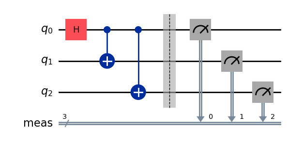
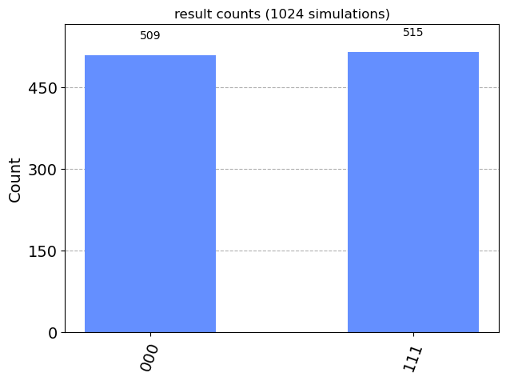
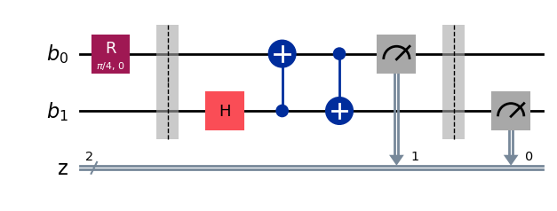
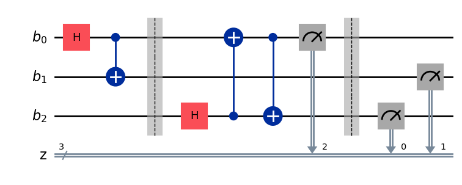
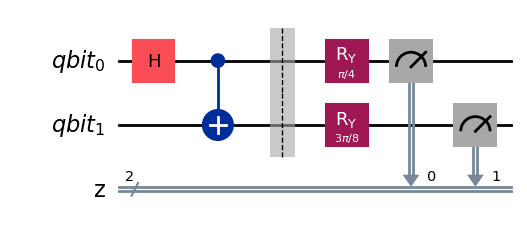
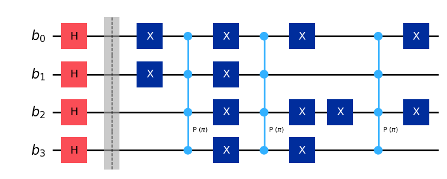
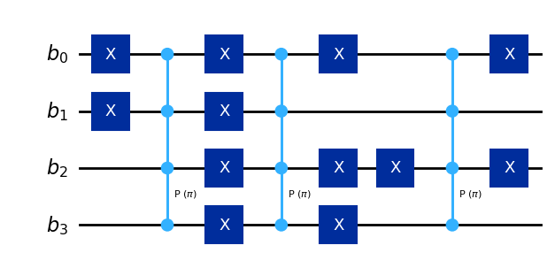
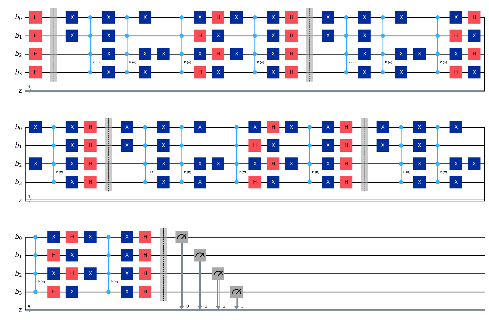
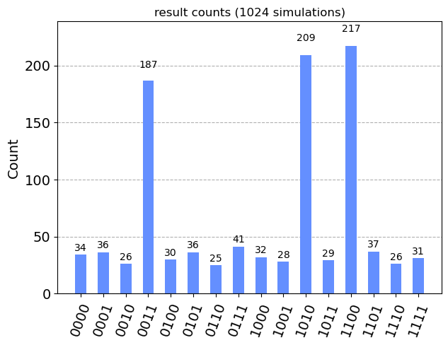

# Quantum Computing Algorithms

## Author
Panagiotis Sotirios Georgiadis

## Table of Contents

1. [Introduction](#introduction)
2. [Project Structure](#project-structure)
3. [Implemented Algorithms](#implemented-algorithms)
   - [GHZ State](#ghz-state)
   - [Quantum Teleportation](#quantum-teleportation)
   - [Bell's Inequality](#bells-inequality)
   - [Grover's Search Algorithm](#grovers-search-algorithm)
4. [Setup and Usage](#setup-and-usage)
5. [Testing](#testing)
6. [License](#license)

## Introduction

This project explores fundamental quantum computing concepts and algorithms, demonstrating their implementation using IBM's Qiskit framework. By working through these algorithms, we gain deep insights into quantum superposition, entanglement, quantum measurement, and quantum speedup.

The quantum computing field represents a paradigm shift in computational capabilities, leveraging the principles of quantum mechanics to solve problems that are intractable for classical computers. This project showcases several key quantum phenomena and algorithms that form the foundation of quantum information science:

1. **Quantum Superposition and Entanglement**: The GHZ state and Bell's inequality experiments demonstrate these fundamental quantum properties. Superposition allows quantum bits (qubits) to exist in multiple states simultaneously, while entanglement creates correlations between qubits that are stronger than anything possible in classical physics. These properties are central to the power of quantum computing.

2. **No-Cloning Theorem and Quantum Teleportation**: The quantum teleportation protocol is a brilliant application of entanglement that circumvents the no-cloning theorem. This theorem, which states that it's impossible to create an identical copy of an arbitrary unknown quantum state, is a fundamental principle in quantum mechanics. Quantum teleportation provides a way to transmit quantum information using entanglement and classical communication, a crucial capability for quantum networks and distributed quantum computing.

3. **Quantum Parallelism and Amplitude Amplification**: Grover's search algorithm demonstrates how quantum computers can achieve quadratic speedup over classical algorithms for unstructured search problems. This algorithm leverages quantum parallelism to simultaneously evaluate a function for multiple inputs, and uses clever phase manipulations (amplitude amplification) to increase the probability of measuring the desired result.

The implementation of these algorithms requires a deep understanding of quantum mechanics, linear algebra, and computer science. It demonstrates skills in:

- Quantum circuit design and implementation
- Understanding and application of quantum gates and measurements
- Manipulation of quantum states and phases
- Quantum algorithm analysis and optimization
- Quantum simulation and result interpretation

The knowledge and skills demonstrated in this project have far-reaching applications:

- **Cryptography**: Quantum key distribution protocols, based on principles similar to those in Bell's inequality, can provide unconditionally secure communication.
- **Optimization**: Techniques similar to those in Grover's algorithm can be applied to a wide range of optimization problems in fields like finance, logistics, and machine learning.
- **Quantum Simulation**: The ability to create and manipulate entangled states like the GHZ state is crucial for quantum simulation of complex quantum systems in chemistry and materials science.
- **Quantum Networks**: Quantum teleportation is a key protocol for quantum repeaters and quantum internet technologies.

The complexity of these implementations should not be understated. Quantum computing sits at the intersection of advanced physics, mathematics, and computer science. It requires navigating the counterintuitive realm of quantum mechanics, where traditional computing intuitions often fail. The ability to translate these abstract quantum concepts into concrete algorithms and implement them using current quantum computing frameworks is a significant achievement.

Moreover, this work is at the forefront of a technological revolution. As quantum computers continue to advance, the algorithms and techniques demonstrated here will form the building blocks of future quantum applications that could revolutionize fields from drug discovery to financial modeling to artificial intelligence.

By mastering these concepts and their implementation, one demonstrates not just technical skill, but the ability to think in a completely new computational paradigm – a skill that will be increasingly valuable as quantum computing continues to evolve and find new applications across various industries and scientific disciplines.

## Project Structure

The project is organized as follows:

```
quantum_computing_algorithms/
│
├── src/
│   ├── __init__.py
│   ├── ghz_state.py
│   ├── quantum_teleportation.py
│   ├── bell_inequality.py
│   └── grover_search.py
│
├── tests/
│   ├── __init__.py
│   ├── test_ghz_state.py
│   ├── test_quantum_teleportation.py
│   ├── test_bell_inequality.py
│   └── test_grover_search.py
│
├── visualizations/
│   └── (various .png files)
│
├── README.md
└── requirements.txt
```

Each algorithm is implemented in a separate Python file in the `src/` directory, with corresponding test files in the `tests/` directory. The `visualizations/` directory contains images of quantum circuits and results.

## Implemented Algorithms

### GHZ State

The GHZ state is a maximally entangled quantum state of three or more qubits, named after Greenberger, Horne, and Zeilinger. It's a fundamental resource in quantum information and computation.

#### Implementation (`src/ghz_state.py`)

This file contains:
- `create_ghz_circuit()`: Creates a quantum circuit that generates the GHZ state.
- `run_ghz_experiment()`: Executes the GHZ circuit and returns measurement results.

#### GHZ Circuit


This circuit creates the GHZ state |ψ⟩ = (|000⟩ + |111⟩) / √2 using Hadamard and CNOT gates.

#### GHZ Results


The histogram shows the measurement results of the GHZ state. We see approximately equal probabilities for |000⟩ and |111⟩ states, as expected.

#### Testing (`tests/test_ghz_state.py`)

The test file verifies:
- Correct circuit construction
- Expected measurement outcomes
- Proper entanglement of qubits

### Quantum Teleportation

Quantum teleportation is a protocol that transfers a quantum state from one qubit to another using entanglement and classical communication.

#### Implementation (`src/quantum_teleportation.py`)

This file includes:
- `quantum_teleport()`: Implements the quantum teleportation protocol.
- `create_teleportation_circuit()`: Creates a full quantum teleportation circuit.

#### Quantum Teleportation Circuit


This circuit demonstrates the basic steps of quantum teleportation, including entanglement creation, Bell state measurement, and final state reconstruction.

#### Testing (`tests/test_quantum_teleportation.py`)

The test file checks:
- Correct implementation of teleportation steps
- Preservation of the initial state after teleportation
- Proper entanglement and measurement operations

### Bell's Inequality

The Bell's Inequality experiment demonstrates the non-classical nature of quantum entanglement. We implement the protocol between Alice and Bob as described in the lectures.

#### Implementation (`src/bell_inequality.py`)

This file contains:
- `alice_response()` and `bob_response()`: Implement Alice and Bob's measurement strategies.
- `create_and_run_circuit()`: Creates and executes the Bell inequality experiment circuit.
- `calculate_success_probability()`: Calculates the probability of Alice and Bob winning the CHSH game.

#### Circuit Implementations

1. Alice's response when b1 = False:


2. Alice's response when b1 = True:


3. Bob's response when b2 = True:


4. Alice and Bob's response when b1 = True, b2 = True:


5. Bob's response when b2 = False:


#### Testing (`tests/test_bell_inequality.py`)

The test file verifies:
- Correct implementation of Alice and Bob's strategies
- Expected correlations between measurements
- Violation of the classical CHSH inequality

### Grover's Search Algorithm

Grover's algorithm is a quantum algorithm for unstructured search that achieves quadratic speedup over classical algorithms.

#### Implementation (`src/grover_search.py`)

This file includes:
- `mark_pure_states()`: Implements the oracle for marking specific states.
- `Grover_diffuse()`: Implements the diffusion operator.
- `create_quantum_circuit_for_grover()`: Creates the full Grover's search circuit.
- `run_grover_search()`: Executes the Grover's search algorithm and returns results.

#### Marking Circuit



This circuit implements the marking of specific states using X gates and multi-controlled phase gates (P(π)).

#### Oracle Circuit



The oracle circuit in Grover's algorithm is responsible for marking the solution states.

#### Full Grover's Search Circuit



This image shows the complete Grover's search algorithm circuit.

#### Grover's Search Results



This histogram shows the results of running Grover's search algorithm for 1024 simulations.

#### Testing (`tests/test_grover_search.py`)

The test file checks:
- Correct implementation of the oracle and diffusion operators
- Amplification of marked states
- Overall correctness of the search results

## Setup and Usage

1. Clone this repository
2. Install the required packages: `pip install -r requirements.txt`
3. To run individual algorithms and see their visualizations, execute the corresponding Python file in the `src/` directory. For example:
   ```
   python src/grover_search.py
   ```
   This will run the algorithm and display the relevant circuit diagrams and result histograms.

## Testing

To run all tests:

```
python -m unittest discover -v
```

This command will discover and run all test files in the `tests/` directory.

## License

This project is licensed under the MIT License - see the [LICENSE](LICENSE) file for details.